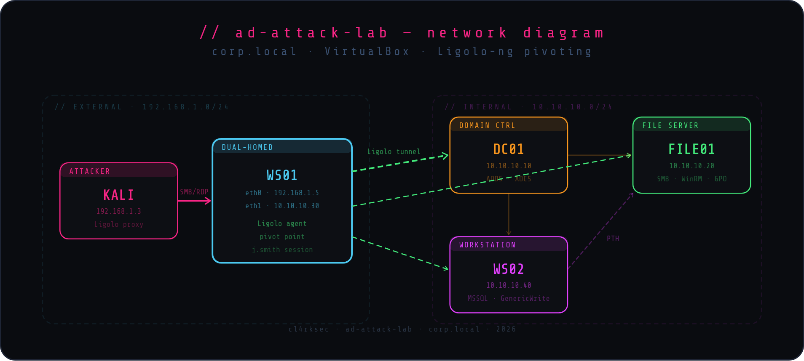

# ad-attack-lab



Laboratorio ofensivo sobre Active Directory con misconfiguraciones intencionales desplegadas via PowerShell. Cubre una cadena de ataque completa desde reconocimiento sin credenciales hasta persistencia, incluyendo LLMNR poisoning, Kerberos attacks, pivoting con Ligolo-ng, ACL abuse y compromiso de dominio vía DCSync + ADCS ESC1.

> Solo para uso en entornos controlados y autorizados.

---

## Attack Chain

```
00 Zero Creds → 01 Enumeration → 02 Credential Attacks → 03 Pivoting
              → 04 Lateral Movement → 05 PrivEsc → 06 Domain Compromise → 07 Persistence
```

| Fase | Vector | Técnica |
|------|--------|---------|
| 00 Zero Creds | Network | Nmap · Responder · LLMNR poisoning → NTLMv2 hash crack |
| 01 Enumeration | AD | CrackMapExec · LDAPDump · BloodHound · domain users/groups |
| 02 Credential Attacks | Kerberos | AS-REP Roasting (mjones) · Kerberoasting → hashcat |
| 03 Pivoting | Tunneling | Ligolo-ng agent → tunnel → red interna alcanzada |
| 04 Lateral Movement | SMB/WinRM | CrackMapExec · SMBClient · SAM dump · loot en FILE01 |
| 05 PrivEsc | ACL / ADCS | GenericWrite · ForceChangePassword · ADCS ESC1 (Certipy) |
| 06 Domain Compromise | DCSync | Impacket secretsdump · Golden Ticket · PTH FILE01 |
| 07 Persistence | IAM | DSRM backdoor configurado en DC01 |

---

## Infrastructure

Desplegada con PowerShell. 4 máquinas Windows con misconfiguraciones intencionales:

| Máquina | Rol | Misconfig |
|---------|-----|-----------|
| `DC01` | Domain Controller + ADCS | ADCS ESC1 habilitado · ACLs débiles · usuarios con privilegios excesivos |
| `FILE01` | File Server | WinRM sin restricciones · GPO misconfiguration · shares con datos sensibles |
| `WS01` | Workstation | Usuario de dominio con sesión activa · preparado para Ligolo-ng |
| `WS02` | Workstation + MSSQL | GenericWrite sobre WS02 · MSSQL expuesto · local admin accesible vía PTH |

```powershell
# Por máquina, ejecutar en orden los scripts de setup/
.\01_join_domain.ps1
.\02_user_setup.ps1
# ...
```

---

## Tools

Scripts ofensivos desarrollados para el lab:

| Script | Función |
|--------|---------|
| `ad_recon.py` | Reconocimiento automatizado del dominio: usuarios, grupos, SPNs, ACLs y trusts |

```bash
python3 tools/ad_recon.py
```

---

## Structure

```
ad-attack-lab/
├── assets/          # Banner del lab
├── attack/          # Evidencia por fase (outputs, summaries)
├── report/          # INFORME.pdf + fuente LaTeX
├── screenshots/     # Evidencia visual (attack + infraestructura)
├── setup/           # Scripts PowerShell de configuración por máquina
└── tools/           # Scripts ofensivos Python
```

---

## Report

Informe técnico completo disponible en [`report/INFORME.pdf`](report/INFORME.pdf).

---

## Author

**Clark Espinal** — [@cl4rksec](https://github.com/espinalclark)  
Junior Pentester | eJPT | ICCA
