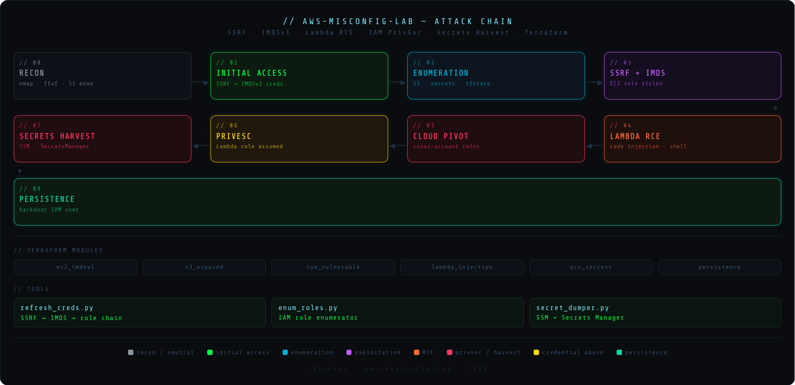

# aws-misconfig-lab



Laboratorio ofensivo sobre AWS con misconfiguraciones intencionales desplegadas via Terraform. Cubre una cadena de ataque completa desde reconocimiento externo hasta persistencia, incluyendo SSRF, credential theft via IMDSv1, Lambda RCE e IAM privilege escalation.

> Solo para uso en entornos controlados y autorizados.

---

## Attack Chain

```
00 Recon → 01 Initial Access → 02 Enumeration → 03 SSRF + IMDS
         → 04 Lambda RCE → 06 PrivEsc → 07 Secrets Harvest → 08 Persistence
```

| Fase | Vector | Técnica |
|------|--------|---------|
| 00 Recon | External | nmap · ffuf · S3 bucket enum |
| 01 Initial Access | SSRF | Endpoint vulnerable → IMDSv1 credential theft |
| 02 Enumeration | AWS CLI | S3 · Lambda · Secrets · terraform.tfstate |
| 03 SSRF + IMDS | IMDSv1 | EC2 instance role credentials confirmed |
| 04 Lambda RCE | Code Injection | Remote code execution via Lambda function |
| 06 PrivEsc | IAM | Lambda role assumed → elevated permissions |
| 07 Secrets Harvest | AWS | SSM Parameter Store · Secrets Manager dump |
| 08 Persistence | IAM | Backdoor IAM user created |

> Fase 05 (Cloud Pivoting) fuera de scope: no se obtuvieron credenciales SSH al jumpbox durante el engagement.

---

## Infrastructure

Desplegada con Terraform. 7 módulos con misconfiguraciones intencionales:

| Módulo | Misconfig |
|--------|-----------|
| `ec2_imdsv1` | IMDSv1 habilitado (sin hop limit) |
| `s3_exposed` | Buckets con ACLs públicas y datos sensibles |
| `iam_vulnerable` | Roles con permisos excesivos y trust policies débiles |
| `lambda_injection` | Función con input no sanitizado → RCE |
| `ecr_secrets` | Secrets hardcodeados en imagen ECR |
| `cloudtrail_off` | CloudTrail deshabilitado (sin logging) |
| `persistence` | IAM user de backdoor pre-configurado |

```bash
cd infrastructure/
terraform init
terraform apply
```

---

## Tools

Scripts ofensivos desarrollados para el lab:

| Script | Función |
|--------|---------|
| `refresh_creds.py` | Automatiza SSRF → IMDSv1 → assume-role → actualiza perfil AWS |
| `enum_roles.py` | Enumera roles IAM comunes e intenta asumirlos |
| `secret_dumper.py` | Extrae todos los secrets de SSM y Secrets Manager |

```bash
python3 tools/refresh_creds.py
python3 tools/enum_roles.py --profile lambda-role
python3 tools/secret_dumper.py --profile lambda-role --output dump.json
```

---

## Structure

```
aws-misconfig-lab/
├── attack/          # Evidencia por fase (outputs, summaries)
├── infrastructure/  # Terraform modules
├── report/          # INFORME.pdf
├── screenshots/     # Evidencia visual (attack + infraestructura)
└── tools/           # Scripts ofensivos Python
```

---

## Report

Informe técnico completo disponible en [`report/INFORME.pdf`](report/INFORME.pdf).

---

## Author

**Clark Espinal** — [@cl4rksec](https://github.com/espinalclark)  
Junior Pentester | eJPT | ICCA
